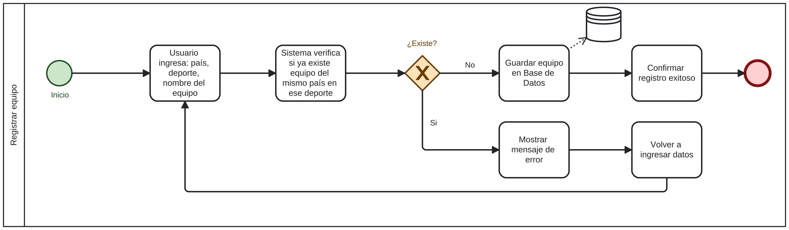
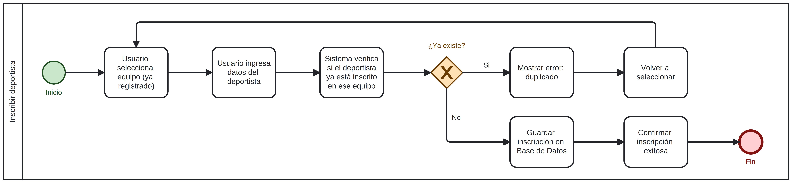
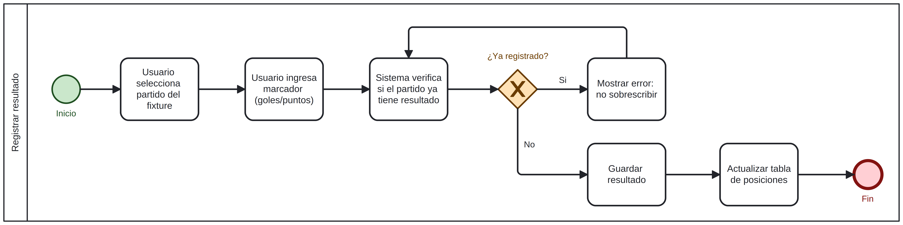

# Sistema Olimpiadas Perú — SOA

**Universidad Tecnológica del Perú · Facultad de Ingeniería**  
**Asignatura:** Arquitectura Orientada al Servicio (1SI84) · 3 créditos · Sección 24230<br>
**Modalidad:** Virtual en vivo<br>
**Docente:** Macedo Ylachoque, Kelvin Celso<br>
**Estudiante:** Huamán Lázaro, Daniel Esteban · U22326979  
**Año:** 2026

---

## Tabla de Contenidos

- [Descripción](#descripción)
- [Resumen ejecutivo](#resumen-ejecutivo)
- [Problemática](#problemática)
- [Solución propuesta](#solución-propuesta)
- [Arquitectura de servicios](#arquitectura-de-servicios)
- [Análisis de Arquitectura Hexagonal](#análisis-de-arquitectura-hexagonal)
- [Estado Actual y Cumplimiento](#estado-actual-y-cumplimiento)
- [Cumplimiento por Clases](#cumplimiento-por-clases)
- [Procesos BPMN](#procesos-bpmn)
- [Tecnologías](#tecnologías)
- [Estructura del proyecto](#estructura-del-proyecto)
- [Cómo ejecutar](#cómo-ejecutar)
- [Ejecución con Podman](#ejecución-con-podman)
- [Endpoints REST](#endpoints-rest)
- [Pruebas](#pruebas)
- [Plan de Despliegue](#plan-de-despliegue)
- [Planificación](#planificación)
- [Plan APF3](#plan-apf3-semana-15)
- [Entrega Final (Semana 16)](#entrega-final-semana-16)
- [Referencias](#referencias)

---

## Descripción

Sistema de gestión de eventos deportivos basado en **Arquitectura Orientada a Servicios (SOA)**. Modulariza los procesos críticos de las **Olimpiadas Perú** —competencia deportiva **interna a nivel nacional**— en servicios independientes y reutilizables, expuestos mediante APIs RESTful y consumidos por un cliente web.

Cada equipo representa una de las **25 regiones del Perú** (Amazonas, Áncash, Arequipa, Lima, etc.). No es una competencia internacional; los participantes son delegaciones regionales peruanas.

Los cuatro deportes obligatorios son:

| Deporte | Categoría |
|---------|-----------|
| Fútbol | Varones |
| Básquet | Varones |
| Vóley | Damas |
| Ping-Pong | Mixto |

## Resumen ejecutivo

Este repositorio constituye la evidencia técnica del proyecto final del curso. La
aplicación permite administrar el ciclo deportivo completo: equipos, deportistas,
fixture, resultados, clasificación, reportes y notificaciones. La solución está
organizada en capas HTTP, negocio y persistencia; se ejecuta de forma local o
contenedorizada y cuenta con pruebas automatizadas, documentación de pruebas no
funcionales y guía de despliegue.

### Alcance comprobable en el repositorio

| Aspecto | Evidencia | Estado |
|---|---|:---:|
| Gestión deportiva | Servicios REST para equipos, deportistas, fixture y resultados | ✅ |
| Acceso y trazabilidad | JWT, bcrypt, roles y registro de auditoría | ✅ |
| Información para usuarios | Tabla, goleadores, estadísticas y gráficos en el cliente web | ✅ |
| Comunicación de eventos | Historial de notificaciones y envío SMTP opcional | ✅ |
| Calidad | 21 pruebas unitarias y de integración automatizadas | ✅ |
| Operación | Contenedor Podman, plan de despliegue y persistencia SQLite | ✅ |
| Evaluación no funcional | Informes reproducibles de rendimiento y seguridad | ✅ |

### Límites conocidos

El proyecto es un prototipo académico funcional. El catálogo es una aproximación
interna a UDDI y OpenAPI facilita el consumo externo, pero no sustituye una
integración B2B real. Tampoco se implementó un ESB ni mensajería asíncrona con
RabbitMQ/Kafka. El informe de seguridad documenta controles pendientes para un
despliegue público: cabeceras HTTP, CORS restringido y limitación de intentos de
inicio de sesión.

## Problemática

La gestión tradicional de eventos deportivos a gran escala depende de procesos manuales o herramientas desconectadas, lo que genera:

- Silos de información y redundancia de datos
- Errores en la asignación de horarios y fixture
- Alta dificultad para escalar a nuevas disciplinas o instituciones
- Falta de transparencia en resultados y tablas de posiciones
- Sin control de acceso diferenciado por rol de usuario

## Solución propuesta

Sistema *API-first* basado en SOA que separa la lógica de negocio en **siete servicios funcionales** con contratos de interfaz claros: autenticación, equipos, deportistas, fixture, partidos, reportes y notificaciones. El catálogo complementa estos servicios con descubrimiento interno. Incluye autenticación JWT con tres roles (admin / operador / visualizador) para control de acceso diferenciado.

---

## Arquitectura de servicios

### Servicio de Autenticación (`/auth`)
Gestiona el acceso al sistema mediante JWT y bcrypt.

| Operación | Descripción |
|---|---|
| `login(username, password)` | Autentica al usuario y retorna token JWT |
| `registrarUsuario(username, password, rol)` | Crea una cuenta nueva (solo admin) |
| `listarUsuarios()` | Lista todos los usuarios del sistema (solo admin) |
| `eliminarUsuario(id)` | Elimina un usuario (solo admin, no puede autoeliminar) |

### Servicio de Equipos (`/equipos`)
Gestiona los equipos participantes.

| Operación | Descripción |
|---|---|
| `registrarEquipo(region, deporte, nombreEquipo)` | Registra un equipo con validación de unicidad por región (solo admin/operador) |
| `consultarEquipos()` | Devuelve el listado completo de equipos |
| `eliminarEquipo(idEquipo)` | Elimina un equipo si no tiene partidos asignados (solo admin/operador) |

### Servicio de Deportistas (`/deportistas`)
Administra la inscripción de deportistas en equipos.

| Operación | Descripción |
|---|---|
| `inscribirDeportista(idEquipo, datos)` | Inscribe un deportista validando duplicados (solo admin/operador) |
| `listarDeportistasPorEquipo(idEquipo)` | Lista los deportistas de un equipo |

### Servicio de Partidos (`/partidos`)
Gestiona resultados y tabla de posiciones.

| Operación | Descripción |
|---|---|
| `registrarResultado(idPartido, golesLocal, golesVisitante)` | Registra resultado (no sobrescribible, solo admin/operador) |
| `consultarTablaPosiciones(deporte)` | Calcula y devuelve la tabla de posiciones por deporte |

### Servicio de Fixture (`/fixture`)
Genera el calendario de enfrentamientos aleatorios.

| Operación | Descripción |
|---|---|
| `generarFixture(deporte)` | Crea emparejamientos aleatorios con fechas (mínimo 2 equipos, solo admin/operador) |
| `consultarFixture(deporte)` | Devuelve el calendario de partidos por deporte |

### Servicio de Reportes (`/reportes`)
Reportes públicos con datos agregados, consumidos por la pestaña "Reportes" del frontend (gráficos con Chart.js).

| Operación | Descripción |
|---|---|
| `tabla(deporte)` | Tabla de posiciones (alias de `/partidos/tabla`) |
| `goleadores(deporte, limite?)` | Ranking de goleadores por deporte |
| `estadisticas(deporte)` | Partidos jugados/pendientes, goles totales, promedio y equipo líder |

### Servicio de Notificaciones (`/notificaciones`)
Historial de notificaciones (correo) disparadas automáticamente al registrar equipos, resultados y usuarios nuevos.

| Operación | Descripción |
|---|---|
| `listarNotificaciones()` | Lista el historial de notificaciones enviadas/simuladas (solo admin) |

Si `SMTP_HOST`/`SMTP_USER` están configurados en el entorno, se intenta un envío real por correo; si no, la notificación queda registrada igualmente con estado `simulado` (no finge un envío que no ocurrió).

---

## Análisis de Arquitectura Hexagonal

> **Contexto (Semana 9 — Tema del sílabo):** ¿El prototipo usa o puede usar arquitectura hexagonal? ¿Genera valor?

### ¿Qué es la Arquitectura Hexagonal?

La arquitectura hexagonal (Ports & Adapters, propuesta por Alistair Cockburn) separa el sistema en tres zonas:

- **Core / Dominio:** lógica de negocio pura, sin dependencias de infraestructura.
- **Puertos:** interfaces que definen cómo el core se comunica hacia afuera.
- **Adaptadores:** implementaciones concretas de esos puertos (HTTP, base de datos, etc.).

### ¿El prototipo la usa actualmente?

**Sí, parcialmente.** La estructura actual ya separa rutas HTTP, lógica de negocio y acceso a datos, aunque todavía no llega a una hexagonal pura con puertos abstractos explícitos.

| Componente actual | Rol en arquitectura hexagonal |
|---|---|
| `app.py` con `create_app()` | Bootstrap / adaptador de arranque |
| Blueprints Flask (`servicios/*.py`) | Adaptadores HTTP de entrada |
| `core/services/*.py` | Lógica de negocio |
| `core/repositories/*.py` | Adaptadores de persistencia SQLite |
| `database.py` | Infraestructura de conexión e inicialización |

El principal punto de mejora pendiente es formalizar puertos/interfaces para que el core no conozca implementaciones concretas de repositorio.

### ¿Puede adoptarla?

Sí. La evolución natural sería:

```
app/
├── core/
│   ├── services/            # Lógica de negocio pura
│   ├── repositories/        # Implementaciones SQLite actuales
│   └── errors.py            # Errores de dominio
├── servicios/               # Adaptadores HTTP Flask
├── database.py              # Infraestructura SQLite
└── puertos/                 # Futuro: interfaces abstractas / protocolos
```

### ¿Genera valor para este proyecto?

| Beneficio | Aplica al proyecto |
|---|---|
| Cambiar SQLite por PostgreSQL sin tocar el core | ✅ Sí — relevante si escala |
| Probar la lógica sin levantar Flask ni BD | ✅ Sí — facilita pruebas unitarias |
| Cambiar de REST a GraphQL o gRPC | ✅ Sí — sin reescribir reglas de negocio |
| Justifica la complejidad para un sistema de esta escala | ⚠ Parcialmente — para producción sí, para prototipo académico agrega overhead |

**Conclusión:** La arquitectura hexagonal *ya empezó a adoptarse* y *genera valor real* para pruebas, mantenimiento y reducción de acoplamiento. Aún no es una hexagonal pura, pero la separación actual entre HTTP, negocio e infraestructura ya es defendible para el alcance del proyecto.

---

## Estado Actual y Cumplimiento

El proyecto actual **sí cumple de forma consistente con el enfoque del curso** para un prototipo académico SOA. No se trata solo de una API funcionando: ya incorpora separación por servicios, control de acceso, modelado BPMN, contenedorización reproducible con Podman y pruebas automatizadas.

### Estado técnico actual

- Arquitectura por servicios: `auth`, `equipos`, `deportistas`, `fixture` y `partidos`
- API REST con contratos claros por recurso
- Autenticación JWT con roles `admin`, `operador` y `visualizador`
- Frontend web modular en JavaScript ES Modules
- Persistencia SQLite con inicialización automática
- Ejecución `podman-first`, sin dependencia obligatoria de `venv`
- App factory Flask con `create_app()`
- Separación en capas:
  - `servicios/` como adaptadores HTTP
  - `core/services/` como lógica de negocio
  - `core/repositories/` como acceso a datos
  - `core/security.py` para JWT
- Pruebas automatizadas:
  - unitarias de servicios
  - integración Flask + SQLite temporal

### Cumplimiento respecto al sílabo

| Tema del curso | Estado en el proyecto | Evidencia |
|---|---|---|
| Fundamentos SOA y orientación a servicios | ✅ Cumplido | Servicios desacoplados por dominio y contratos REST |
| Diseño de servicios | ✅ Cumplido | Endpoints separados por responsabilidad |
| Capas empresariales | ✅ Cumplido | HTTP → negocio → persistencia |
| Seguridad en servicios | ✅ Cumplido | JWT, bcrypt y control por roles |
| BPM y procesos SOA | ✅ Cumplido | Diagramas BPMN vinculados a procesos reales |
| Integridad de procesos | ✅ Cumplido | Validaciones de duplicidad, partidos no sobrescribibles, restricciones por rol |
| Registro interno de servicios | ✅ Cumplido | Catálogo de servicios dinámico (UDDI) en `/catalog/` |
| Descubrimiento y documentación para consumo externo | ✅ Cumplido | Catálogo interno en `/catalog/` y OpenAPI 3.0 interactivo en `/docs` |
| Auditoría / Service Bus | ✅ Cumplido | Registro persistente de operaciones críticas (Audit Trail) |
| Pruebas y calidad | ✅ Cumplido | Tests unitarios y de integración ejecutables en Podman |

### Juicio académico práctico

Para fines del curso, el proyecto es **técnicamente defendible** porque demuestra:

- diseño orientado a servicios (capas desacopladas)
- separación de responsabilidades (adaptadores, negocio, persistencia)
- soporte a procesos de negocio y lógica de integridad
- seguridad de acceso (JWT, bcrypt, roles)
- trazabilidad conceptual con BPMN
- despliegue reproducible en contenedores (Podman)
- pruebas automáticas de comportamiento e integración
- registro y catálogo UDDI de servicios (`/catalog/`)
- documentación OpenAPI y Swagger UI interactivo (`/docs`)
- auditoría de operaciones críticas (Audit Trail)

Lo que **todavía no conviene afirmar como terminado** es:

- integración por bus de servicios empresariales (ESB) o mensajería asíncrona avanzada (RabbitMQ/Kafka)

En otras palabras: cumple los requisitos técnicos verificables registrados en el
repositorio. La aprobación de exposiciones, entregas en UTP Class, PPT y demás
evidencias externas depende de la validación del docente.

---

## Cumplimiento por Clases

Además del sílabo general, el proyecto fue contrastado contra los criterios registrados en [clases/curso.json](clases/curso.json) y [clases/requisitos.json](clases/requisitos.json), que representan las consignas y avances reales trabajados en clase.

### Corte práctico evaluado

`clases/requisitos.json` cubre desde la semana 1 hasta la **semana 16** (Entrega Final),
mapeado contra el contenido real de cada clase registrado en `clases/curso.json` (no contra
el sílabo genérico). `clases/validador.py` detecta automáticamente la semana según la fecha
y evalúa cada requisito con reglas de código (`archivo`, `directorio`, `codigo` con
`comando`/`minimo_commits`) o lo marca `manual` cuando es una entrega externa (UTP Class,
exposición oral) que no puede verificarse leyendo el repositorio.

### Resultado del contraste

| Bloque | Estado |
|---|---|
| Semana 4 — Gantt, BPMN, servicios, tecnologías | ✅ Cumplido |
| Semana 6 — ambiente, Git, `.gitignore` | ✅ Cumplido |
| Semana 7 — autenticación, conexión a BD, `SECRET_KEY` por entorno | ✅ Cumplido técnicamente |
| Semana 8 — equipos, deportistas, BD, frontend | ✅ Cumplido |
| Semana 9 — calendario, partidos, login, análisis hexagonal | ✅ Cumplido / parcial en lo documental manual |
| Semana 10 — autenticación + BD + 30% funcionalidad + GitHub | ✅ Cumplido técnicamente / exposición manual pendiente de validación docente |
| Semana 11 — DDD, Clean vs Hexagonal, capas empresariales en código | ✅ Cumplido en código / propuestas DDD son entrega manual a UTP Class |
| Semana 12 — Onion, commits, reportes con gráficos, notificaciones, SOLID | ✅ Cumplido técnicamente / sustentación de patrones es manual |
| Semana 13 — Cloud (IaaS/PaaS/SaaS), documentación coincidente | ⚠ Manual (tarea individual y revisión docente) |
| Semana 14 — sustentación individual del código | ⚠ Manual (exposición) |
| Semana 15 — exposición del proyecto (Avance 3) | ⚠ Manual (exposición) |
| Semana 16 — Entrega Final: rendimiento, seguridad, plan de despliegue | ✅ Cumplido técnicamente / presentación final pendiente (manual) |

### Aclaración sobre el validador automático

El validador de `clases/validador.py` usa reglas de texto simples. Debido a la refactorización del proyecto:

- `bcrypt` ya no vive directamente en `app/auth.py`, sino en `app/core/services/auth_service.py`
- `os.environ` para `SECRET_KEY` ya no se usa directamente en `app/auth.py`, sino en `app/core/security.py`

Por eso, un chequeo textual rígido puede marcar falsos negativos aunque **la implementación sí cumpla técnicamente** con la intención de la clase: autenticación segura, contraseñas encriptadas y clave JWT fuera de la lógica HTTP.

### Juicio final según clases

Tomando en cuenta las consignas registradas en clase, el proyecto:

- **sí cumple** con la parte documental inicial
- **sí cumple** con la base funcional del segundo avance
- **sí cumple** con separación por servicios, autenticación y persistencia
- **todavía depende de validación manual del docente** en elementos como exposiciones, subidas a UTP Class y entregas presentadas en sala

En términos prácticos: **el proyecto está alineado con lo pedido en clases y el README ya refleja ese estado real**.

---

## Procesos BPMN

Los flujos de negocio están modelados en cuatro diagramas ubicados en `docs/bpmn/`:

| Diagrama | Descripción |
|---|---|
| [Registrar equipo](docs/bpmn/Diagrama_1_Registrar_equipo.png) | Valida unicidad por región y deporte antes de guardar |
| [Inscribir deportista](docs/bpmn/Diagrama_2_Inscribir_deportista.png) | Valida que el deportista no esté ya inscrito |
| [Registrar resultado](docs/bpmn/Diagrama_3_Registrar_resultado.png) | Solo permite registrar si el partido no tiene resultado previo |
| [Generar fixture](docs/bpmn/Diagrama_4_Generar_fixture_simple.png) | Solo genera si hay al menos 2 equipos en el deporte |

### Detalle de los Diagramas de Procesos

#### 1. Registrar equipo

> *Se inicia el proceso ingresando valores como región, deporte y nombre del equipo. Luego el sistema verifica si ya existe un equipo de la misma región en ese deporte. **Si NO existe**, se guarda el equipo en la base de datos y se confirma el registro exitoso. **Si SÍ existe**, se muestra un mensaje de error y se regresa al paso de ingresar datos para corregir o intentar con otra región/deporte.*

#### 2. Inscribir deportista

> *Se inicia el proceso seleccionando un equipo ya registrado. Luego se ingresan los datos del deportista. El sistema verifica si ese deportista ya está inscrito en el equipo seleccionado. **Si NO existe** (es decir, el deportista no está aún en ese equipo), se guarda la inscripción y se confirma el registro exitoso. **Si SÍ existe**, se muestra un mensaje de error (deportista duplicado) y se regresa a la selección del equipo para reiniciar el proceso.*

#### 3. Registrar resultado

> *Se inicia el proceso seleccionando un partido del fixture previamente generado. Luego se ingresa el marcador (goles o puntos). El sistema verifica si ese partido ya tiene un resultado registrado. **Si NO existe** (aún no se ha registrado resultado), se guarda el marcador y se actualiza automáticamente la tabla de posiciones. **Si SÍ existe**, se muestra un mensaje de error indicando que no se puede sobrescribir el resultado y el proceso termina sin cambios.*

#### 4. Generar fixture

> *Se inicia el proceso cuando el usuario solicita el sorteo para un deporte específico. El sistema cuenta cuántos equipos están inscritos en ese deporte. **Si hay al menos 2 equipos**, se generan enfrentamientos aleatorios, se asignan fechas y horas básicas, se guarda el fixture y se notifica a los equipos. **Si hay menos de 2 equipos**, se muestra un mensaje de error (equipos insuficientes) y el proceso termina sin generar fixture.*

---

## Tecnologías

| Capa | Tecnología | Justificación |
|---|---|---|
| Lenguaje backend | Python 3 | Sintaxis clara, gran ecosistema para APIs |
| Framework API | Flask + Flask-CORS | Ligero, ideal para SOA con blueprints modulares |
| Autenticación | PyJWT + bcrypt | JWT stateless para APIs REST, bcrypt para hash seguro de contraseñas |
| Base de datos | SQLite (`olimpiadas.db`) | Sin servidor, fácil despliegue académico |
| Frontend | HTML5 + Tailwind CSS + JavaScript (ES Modules) | UI responsiva sin build tools, módulos JS por servicio |
| Control de versiones | Git + GitHub | Historial de commits, colaboración y entrega |
| Entorno | venv / Podman | Aislamiento de dependencias y despliegue reproducible |

---

## Estructura del proyecto

```
Proyecto-Olimpiadas/
├── README.md
├── .gitignore
├── Containerfile
├── compose.yml
├── podman-compose.yml
├── tests/                          # Pruebas unitarias e integración
├── app/                            # Aplicación Flask
│   ├── app.py                      # App factory y bootstrap Flask
│   ├── auth.py                     # Adaptador HTTP y decoradores de autenticación
│   ├── core/
│   │   ├── services/                    # Lógica de negocio desacoplada de Flask
│   │   │   ├── auth_service.py, equipos_service.py, deportistas_service.py,
│   │   │   │   fixture_service.py, partidos_service.py
│   │   │   ├── audit_service.py         # Auditoría de operaciones críticas
│   │   │   └── notification_service.py  # Envío/registro de notificaciones
│   │   ├── repositories/           # Acceso a datos SQLite (uno por dominio, incluye
│   │   │                           #   audit_repository.py y notification_repository.py)
│   │   ├── security.py             # JWT y utilidades de seguridad
│   │   └── errors.py               # Errores de dominio
│   ├── database.py                 # Inicialización y conexión SQLite
│   ├── requirements.txt            # Dependencias Python
│   ├── olimpiadas.db               # Base de datos SQLite (se genera al primer arranque)
│   ├── servicios/
│   │   ├── equipos.py              # Rutas HTTP de Equipos
│   │   ├── deportistas.py          # Rutas HTTP de Deportistas
│   │   ├── partidos.py             # Rutas HTTP de Partidos
│   │   ├── fixture.py              # Rutas HTTP de Calendario
│   │   ├── reportes.py             # Rutas HTTP de Reportes (goleadores, estadísticas)
│   │   ├── notificaciones.py       # Rutas HTTP de Notificaciones (solo admin)
│   │   ├── notify.py               # Helper interno: dispara notificaciones best-effort
│   │   └── catalog.py              # Catálogo de servicios (UDDI simplificado)
│   ├── static/
│   │   ├── data/
│   │   │   ├── regiones.json       # 25 regiones del Perú
│   │   │   └── deportes.json       # 4 deportes con categoría
│   │   ├── openapi.json            # Índice OpenAPI 3.0 (modular, con $ref por servicio)
│   │   ├── openapi/
│   │   │   ├── schemas.json        # Componentes compartidos (ej. TablaPosicionesItem)
│   │   │   └── services/           # Un archivo de paths por servicio (auth, equipos, ...)
│   │   └── js/
│   │       ├── main.js             # Punto de entrada JS
│   │       └── modules/            # Módulos ES por servicio
│   │           ├── config.js, ui.js, autocomplete.js, searchSelect.js
│   │           ├── equipos.js, deportistas.js, fixture.js, partidos.js
│   │           ├── usuarios.js, reportes.js, notificaciones.js
│   │           └── shell.js         # Tabs, formulario de resultado y goleadores
│   └── templates/
│       ├── index.html              # Interfaz principal (Tailwind CSS)
│       ├── login.html              # Página de autenticación
│       └── docs.html               # Swagger UI (sirve app/static/openapi.json)
├── docs/
│   ├── bpmn/                       # Diagramas BPMN (.bpmn, .png, .svg)
│   ├── referencias/                # PDFs de referencias académicas
│   ├── pruebas/
│   │   ├── rendimiento/            # Script de carga + INFORME_RENDIMIENTO.md
│   │   └── seguridad/              # Script de pruebas OWASP + INFORME_SEGURIDAD.md
│   └── PLAN_DESPLIEGUE.md          # Guía paso a paso para desplegar en una máquina nueva
└── silabus/                        # Sílabo oficial del curso
```

---

## Cómo ejecutar

### 1. Clonar el repositorio

```bash
git clone https://github.com/DanielLazaro1555/Proyecto-Olimpiadas.git
cd Proyecto-Olimpiadas
```

### 2. Crear y activar el entorno virtual

```bash
python3 -m venv venv

# Linux / macOS
source venv/bin/activate

# Windows
venv\Scripts\activate
```

### 3. Instalar dependencias

```bash
pip install -r app/requirements.txt
```

### 4. Ejecutar la aplicación

```bash
cd app
python app.py
```

La aplicación estará disponible en `http://127.0.0.1:5000`

> La base de datos `olimpiadas.db` se inicializa automáticamente al primer arranque con las tablas necesarias y un usuario `admin` / `admin123` para comenzar.

### 5. Ejecutar pruebas unitarias

Si quieres mantener el flujo `podman-first`, puedes correr las pruebas dentro de la imagen del proyecto:

```bash
podman run --rm \
  -v "$(pwd)":/workspace:Z \
  -w /workspace \
  localhost/proyecto-olimpiadas:latest \
  python -m unittest discover -s tests -v
```

Esto ejecuta:

- `tests/test_services.py` para lógica de negocio
- `tests/test_integration.py` para endpoints Flask con SQLite temporal

### Variables de entorno relevantes

| Variable | Descripción | Valor por defecto |
|---|---|---|
| `SECRET_KEY` | Clave usada para firmar JWT | Sin valor hardcodeado — si no se define, se genera una clave aleatoria por proceso (las sesiones no sobreviven a un reinicio). **Definir explícitamente en producción** — ver [Plan de Despliegue](docs/PLAN_DESPLIEGUE.md) |
| `FLASK_DEBUG` | Activa/desactiva modo debug al ejecutar `python app.py` | `false` |
| `PORT` | Puerto HTTP de la app | `5000` |
| `DATABASE_PATH` | Ruta del archivo SQLite | `olimpiadas.db` local / `/data/olimpiadas.db` en contenedor |
| `SMTP_HOST`, `SMTP_USER`, `SMTP_PASS`, `SMTP_PORT` | Envío real de notificaciones por correo (opcional) | Sin configurar → notificaciones quedan como `simulado` |
| `NOTIFY_EMAIL` | Destinatario de las notificaciones internas | `admin@olimpiadasperu.local` |

## Ejecución con Podman

El proyecto incluye configuración nativa para `podman`, sin depender de Docker.

### Opción 1. Levantar todo con `podman-compose`

1. Crear archivo de entorno para el contenedor y definir un `SECRET_KEY` real
   (obligatorio: `compose.yml`/`podman-compose.yml` fallan si no está definido):

```bash
cp app/.env.podman.example app/.env
python3 -c "import secrets; print(secrets.token_hex(32))"
# copiar el resultado como valor de SECRET_KEY en app/.env
```

2. Construir e iniciar:

```bash
podman-compose up --build -d
```

3. Abrir la aplicación:

```text
http://127.0.0.1:5000
```

4. Detener:

```bash
podman-compose down
```

La base de datos queda persistida en el volumen `olimpiadas_data`.

### Opción 2. Usar `podman` directo

Construcción de imagen:

```bash
podman build -t localhost/proyecto-olimpiadas:latest -f Containerfile .
```

Creación del volumen persistente:

```bash
podman volume create olimpiadas_data
```

Ejecución del contenedor:

```bash
podman run -d \
  --name proyecto-olimpiadas-app \
  -p 5000:5000 \
  --env-file app/.env \
  -e DATABASE_PATH=/data/olimpiadas.db \
  -v olimpiadas_data:/data:Z \
  localhost/proyecto-olimpiadas:latest
```

Ver logs:

```bash
podman logs -f proyecto-olimpiadas-app
```

Detener y eliminar:

```bash
podman stop proyecto-olimpiadas-app
podman rm proyecto-olimpiadas-app
```

### Credenciales por defecto

| Usuario | Contraseña | Rol |
|---------|-----------|-----|
| `admin` | `admin123` | Administrador (acceso completo + gestión de usuarios) |
| `operador` | `operador123` | Operador (gestión deportiva, sin gestión de usuarios) |
| `viewer` | `viewer123` | Visualizador (solo consulta) |

---

## Endpoints REST

### Autenticación — `/auth`

| Método | Ruta | Auth | Descripción |
|---|---|---|---|
| POST | `/auth/login` | — | Iniciar sesión, retorna token JWT |
| POST | `/auth/registro` | Admin | Registrar nuevo usuario |
| GET | `/auth/usuarios` | Admin | Listar todos los usuarios |
| DELETE | `/auth/usuarios/<id>` | Admin | Eliminar un usuario |
| GET | `/auth/auditoria` | Admin | Consultar historial de auditoría del sistema |

### Equipos — `/equipos`

| Método | Ruta | Auth | Descripción |
|---|---|---|---|
| GET | `/equipos/` | — | Listar todos los equipos |
| POST | `/equipos/` | Admin/Op | Registrar un nuevo equipo |
| DELETE | `/equipos/<id>` | Admin/Op | Eliminar un equipo |

### Deportistas — `/deportistas`

| Método | Ruta | Auth | Descripción |
|---|---|---|---|
| GET | `/deportistas/equipo/<id>` | — | Listar deportistas de un equipo |
| POST | `/deportistas/inscribir` | Admin/Op | Inscribir un deportista |

### Fixture — `/fixture`

| Método | Ruta | Auth | Descripción |
|---|---|---|---|
| POST | `/fixture/generar/<deporte>` | Admin/Op | Generar calendario para un deporte |
| DELETE | `/fixture/eliminar/<deporte>` | Admin/Op | Eliminar el calendario de un deporte |
| GET | `/fixture/consultar/<deporte>` | — | Consultar partidos de un deporte |

### Partidos — `/partidos`

| Método | Ruta | Auth | Descripción |
|---|---|---|---|
| POST | `/partidos/resultado` | Admin/Op | Registrar resultado de un partido |
| GET | `/partidos/tabla/<deporte>` | — | Consultar tabla de posiciones |

### Reportes — `/reportes`

| Método | Ruta | Auth | Descripción |
|---|---|---|---|
| GET | `/reportes/tabla/<deporte>` | — | Tabla de posiciones (alias de `/partidos/tabla`) |
| GET | `/reportes/goleadores/<deporte>` | — | Ranking de goleadores (`?limite=` opcional, 1-50) |
| GET | `/reportes/estadisticas/<deporte>` | — | Partidos jugados/pendientes, goles y promedio |

### Notificaciones — `/notificaciones`

| Método | Ruta | Auth | Descripción |
|---|---|---|---|
| GET | `/notificaciones/` | Admin | Historial de notificaciones enviadas/simuladas |

### Catálogo y Documentación (Descubrimiento SOA)

| Método | Ruta | Auth | Descripción |
|---|---|---|---|
| GET | `/catalog/` | — | Registro interno de servicios (Catálogo UDDI) |
| GET | `/docs` | — | Interfaz de Swagger UI con especificación OpenAPI 3.0 |

> **Auth:** `—` = público · `Admin` = solo administrador · `Admin/Op` = administrador u operador

---

## Pruebas

### Unitarias e integración

21 pruebas (`tests/test_services.py` + `tests/test_integration.py`) cubriendo lógica de
negocio (equipos, deportistas, fixture, partidos, goleadores, notificaciones) y endpoints
Flask de extremo a extremo contra una SQLite temporal:

```bash
source venv/bin/activate
python -m unittest discover -s tests -v
```

Resultado verificado en la revisión final: **21 pruebas ejecutadas, 0 fallos**.
La suite usa `unittest`, incluido en Python; por ello puede ejecutarse después de
instalar únicamente `app/requirements.txt`, sin depender de `pytest`.

### Pruebas de rendimiento

Script propio en Python estándar (sin JMeter, no disponible en el entorno de desarrollo) —
ver [`docs/pruebas/rendimiento/`](docs/pruebas/rendimiento/). Tres escenarios: lecturas
públicas concurrentes, login concurrente (costo real de bcrypt) y escrituras concurrentes
(contención de SQLite). Resultados e informe completo en
[`INFORME_RENDIMIENTO.md`](docs/pruebas/rendimiento/INFORME_RENDIMIENTO.md).

| Escenario (20 clientes concurrentes) | Peticiones | Errores | Latencia p95 |
|---|---:|---:|---:|
| Lecturas públicas | 400 | 0 | 22.2 ms |
| Inicio de sesión con bcrypt | 200 | 0 | 682.4 ms |
| Escrituras concurrentes en SQLite | 100 | 0 | 185.5 ms |

El costo mayor del login es intencional por bcrypt; la principal mejora futura
identificada es activar WAL en SQLite para reducir la contención de escrituras.

### Pruebas de seguridad

Script propio estilo OWASP (sin ZAP, no disponible en el entorno) — ver
[`docs/pruebas/seguridad/`](docs/pruebas/seguridad/). Cubre inyección SQL, bypass de
autenticación/JWT, IDOR y escalación de privilegios, cabeceras HTTP, CORS y fuerza bruta.
Se encontró y **corrigió en esta misma entrega** un hallazgo crítico (secreto de firma JWT
por defecto hardcodeado y predecible); quedan 3 hallazgos abiertos de severidad media/baja
con recomendación documentada. Detalle completo en
[`INFORME_SEGURIDAD.md`](docs/pruebas/seguridad/INFORME_SEGURIDAD.md).

Las pruebas confirmaron que no fue explotable la inyección SQL, el bypass de JWT
(`alg=none`), ni la escalación de privilegios por roles. El secreto JWT predecible
detectado inicialmente fue corregido. Quedan documentados cuatro hallazgos de
prioridad media/baja para una futura puesta en producción.

---

## Plan de Despliegue

Guía paso a paso para levantar el sistema en una máquina nueva —desde cero, sin dar por
sentado ningún contexto previo—, cubriendo tanto la ruta `venv` como `Podman`, variables
de entorno, verificación post-despliegue, backup y rollback:
[`docs/PLAN_DESPLIEGUE.md`](docs/PLAN_DESPLIEGUE.md).

---

## Planificación (Diagrama de Gantt)

| Actividad | S5 | S6 | S7 | S8 | S9 | S10 | S11 | S12 | S13 | S14 | S15 | S16 | S17 | S18 |
|---|:---:|:---:|:---:|:---:|:---:|:---:|:---:|:---:|:---:|:---:|:---:|:---:|:---:|:---:|
| Análisis y modelado BPMN | ✅ | | | | | | | | | | | | | |
| Diseño de servicios y arquitectura | ✅ | ✅ | | | | | | | | | | | | |
| **APF1** — documentación entregada | **✅** | | | | | | | | | | | | | |
| Configuración de entorno y Git | | ✅ | | | | | | | | | | | | |
| Autenticación JWT + bcrypt | | | ✅ | | | | | | | | | | | |
| Servicio de Equipos | | ✅ | ✅ | | | | | | | | | | | |
| Servicio de Deportistas | | | ✅ | ✅ | | | | | | | | | | |
| Servicio de Fixture | | | | ✅ | ✅ | | | | | | | | | |
| Servicio de Partidos | | | | | ✅ | ✅ | | | | | | | | |
| Frontend (Tailwind + roles) | | | | ✅ | ✅ | ✅ | | | | | | | | |
| Control de roles en UI y backend | | | | | | ✅ | | | | | | | | |
| **APF2** — 30% funcionalidad | | | | | | **✅** | | | | | | | | |
| Registro de servicios (UDDI-like) | | | | | | | X | | | | | | | |
| Integración B2B / OpenAPI docs | | | | | | | | X | X | | | | | |
| SOA + BPM: trazabilidad de procesos | | | | | | | | | X | X | | | | |
| Mejores prácticas SOA | | | | | | | | | | X | X | | | |
| **APF3** — 60% funcionalidad | | | | | | | | | | | **X** | | | |
| Service Bus / auditoría | | | | | | | | | | | | X | X | |
| Pruebas finales y correcciones | | | | | | | | | | | | X | X | |
| **Proyecto Final** | | | | | | | | | | | | | | **X** |

> ✅ = completado · X = planificado

---

## Plan APF3 (Semana 15)

> Esta sección documenta el **plan original** trazado a partir del sílabo genérico
> (Unidad 3 — Semanas 11–15), antes de que ocurrieran esas clases. Las clases reales
> (`clases/curso.json`) terminaron enfocándose en DDD, Clean/Onion Architecture y
> Cloud Computing en vez de UDDI/OpenAPI/auditoría semana a semana — ver
> [Cumplimiento por Clases](#cumplimiento-por-clases) para el mapeo real. Todos los
> ítems técnicos de este plan igual se implementaron (tabla de abajo); para el estado
> más actualizado y el resultado de la Entrega Final, ver
> [Entrega Final (Semana 16)](#entrega-final-semana-16).

Según el sílabo (Unidad 3 — Semanas 11–15), los temas a abordar e implementar son:

### Semana 11 — Implementación SOA: capas empresariales
- Documentar las capas del sistema (presentación → servicio → datos)
- Separación `core/services` + `core/repositories` + adaptadores HTTP Flask

### Semana 12 — Registro de Servicios (concepto UDDI)
- Implementar un endpoint de catálogo que liste los servicios disponibles con sus operaciones y contratos. En la implementación final se expone como `GET /catalog/` (registro interno tipo UDDI simplificado).

### Semana 13 — Integración de procesos / B2B
- Generar documentación OpenAPI (Swagger) de la API para consumo externo
- Exponer un endpoint de metadatos que permita a sistemas externos descubrir los servicios

### Semana 14 — SOA y BPM
- Relacionar explícitamente cada proceso BPMN con su endpoint REST correspondiente en la documentación
- Agregar trazabilidad: registrar en BD quién realizó cada operación (audit log básico)

### Semana 15 — Integridad de procesos + Mejores prácticas SOA
- Validaciones de integridad referencial más robustas
- Manejo de errores estandarizado en todos los endpoints
- Revisión de los 8 principios de diseño de servicios SOA aplicados al proyecto
- **Entrega APF3**

### Avance real del proyecto frente a APF3

| Ítem | Estado actual |
|---|---|
| Capas empresariales | ✅ Implementado |
| Separación core/adaptadores | ✅ Implementado parcialmente |
| Control de roles backend/frontend | ✅ Implementado |
| BPM relacionado con procesos del sistema | ✅ Implementado |
| Validaciones de integridad | ✅ Implementado en operaciones críticas |
| Manejo de errores estandarizado | ✅ Mejorado con errores de dominio |
| Pruebas | ✅ Implementadas |
| Registro de servicios tipo UDDI | ✅ Implementado (`GET /catalog/`) |
| OpenAPI / Swagger | ✅ Implementado (`GET /docs`, spec modular en `app/static/openapi/`) |
| Auditoría | ✅ Implementado (tabla `auditorias` + middleware en `app.py`) |

---

## Entrega Final (Semana 16)

Según `clases/curso.json` (transcripción real de las clases 8 y 9 de julio), la Entrega
Final pide, además del 100% de funcionalidad: reportes con gráficos, notificaciones,
pruebas de rendimiento, pruebas de seguridad con herramienta (sin obligación de corregir
todo lo encontrado) y un plan de despliegue paso a paso.

| Ítem pedido | Estado |
|---|---|
| Funcionalidad al 100% (CRUD + reportes + notificaciones) | ✅ Implementado |
| Reportes con gráficos/estadísticas (goleadores, tabla, resumen) | ✅ Implementado — ver [Servicio de Reportes](#servicio-de-reportes-reportes) y tab "Reportes" del frontend (Chart.js) |
| Notificaciones (correo/confirmaciones) | ✅ Implementado — ver [Servicio de Notificaciones](#servicio-de-notificaciones-notificaciones) |
| Pruebas de rendimiento (JMeter u otra herramienta) | ✅ Documentado — [informe](docs/pruebas/rendimiento/INFORME_RENDIMIENTO.md) |
| Pruebas de seguridad con herramienta (OWASP ZAP u otra) | ✅ Documentado — [informe](docs/pruebas/seguridad/INFORME_SEGURIDAD.md), 1 hallazgo crítico corregido en esta entrega |
| Plan de despliegue paso a paso | ✅ Documentado — [`docs/PLAN_DESPLIEGUE.md`](docs/PLAN_DESPLIEGUE.md) |
| `clases/requisitos.json` extendido semanas 11-16 + fix de `clases/validador.py` | ✅ Hecho (ver [Cumplimiento por Clases](#cumplimiento-por-clases)) |
| Presentación final (PPT) y exposición oral | ⚠ Manual — pendiente de la sesión de exposición (16 o 20 de julio) |

---

## Referencias

- Chamari, L., Petrova, E., & Pauwels, P. (2023). *An end-to-end implementation of a service-oriented architecture for data-driven smart buildings.* IEEE Access, 11, 117261–117281.
- Delgado, A., García-Rodríguez de Guzmán, I., Ruiz, F., & Piattini, M. (2010). *Metodologías de desarrollo para Service Oriented Architectures con Rational Unified Process.*
- López, D. J., Guerrero, J. A., & Díaz Benachí, E. (2014). *Arquitectura Orientada a Servicios - SOA, aplicada a la industria.* Corporación Universitaria Comfacauca.
- Marante Valdivia, M. (2010). *Análisis y diseño de servicios en la adopción de una arquitectura orientada a servicios.* LACCEI 2010, Arequipa, Perú.
- Mohor Tapia, C. A. (2006). *Análisis y diseño de una arquitectura SOA para una institución financiera.* PUCV.

---

> Licencia: [MIT](LICENSE) · Proyecto académico — Universidad Tecnológica del Perú · 2026
